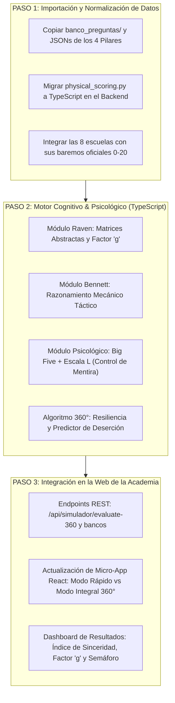

# Análisis de Sinergia, Auditoría Cruzada y Plan de Mejora Integral
## Integración: `test_vocacional` (C:\Users\cabel\Music\test_vocacional) ⟷ `academia-premilitar` (C:\Users\cabel\Videos\academia-premilitar)

---

## 1. RESUMEN EJECUTIVO Y AUDITORÍA DE ACTIVOS

El proyecto ubicado en `C:\Users\cabel\Music\test_vocacional` contiene una base de investigación, baremación y bancos de preguntas de extraordinario valor para las Fuerzas Armadas y Policía Nacional del Perú. Sin embargo, su orientación original fue prioritariamente de **orientación vocacional y conocimientos escolares**, dejando de lado dos filtros determinantes en la admisión castrense real:
1. **La Evaluación de Facultades Cognitivas Superiores** (Matrices de Raven / Factor "g", Aptitud Mecánica de Bennett, Test de Concentración y Resistencia a la Fatiga D2/Toulouse-Piéron).
2. **La Evaluación Psicológica Clínica y Control de Sinceridad** (Escala L de deseabilidad social anti-mentira, control de impulsos para uso de armas de fuego y tolerancia al confinamiento/estrés extremo).

Por su parte, el proyecto `academia-premilitar` cuenta con una **arquitectura tecnológica de vanguardia** (Astro 4.x, React, Node.js, TypeScript, PostgreSQL, Tailwind CSS, embudo de conversión y WhatsApp Sales Engine).

La fusión de ambos ecosistemas crea una plataforma única en el Perú: **El Sistema de Diagnóstico Castrense 360°**, capaz de evaluar aptitud física, facultades cognitivas, estabilidad psicológica y vocación operativa.

---

## 2. INVENTARIO DE ACTIVOS DE `test_vocacional` PARA ABSORCIÓN

```
C:\Users\cabel\Music\test_vocacional
├── banco_preguntas/               🔥 +1,200 preguntas clasificadas por las 8 escuelas y materias
│   ├── banco_maestro_algebra_cuadraticas_8_escuelas.json
│   ├── banco_maestro_aritmetica_razones_8_escuelas.json
│   ├── banco_maestro_fisica_cinematica_8_escuelas.json
│   ├── banco_maestro_geometria_triangulos_8_escuelas.json
│   ├── banco_maestro_historia_doctrina_8_escuelas.json
│   ├── banco_maestro_rm_moviles_8_escuelas.json
│   ├── banco_maestro_rv_analogias_8_escuelas.json
│   └── banco_maestro_trigonometria_razones_8_escuelas.json
├── pilar1_requisitos_legales.json 🛡️ Normativas oficiales de edad, talla e IMC de las 8 escuelas
├── pilar2_evaluacion_psicometrica.json 🧠 150 reactivos IPIP-NEO (Big Five) adaptados al español peruano
├── pilar3_intereses_operativos.json 🎯 100 dilemas tácticos situacionales (VRAEM, frontera, Mar de Grau)
├── pilar4_aptitud_conocimientos.json 📝 150 preguntas pre-militares transversales
├── engine/physical_scoring.py    🏃 Baremos vigesimales (0-20) de 1500m, natación, barras, salto, etc.
└── audio/                        🎺 Himnos oficiales de las FF.AA., marchas y ambientación sonora
```

---

## 3. EL TALÓN DE AQUILES DIAGNOSTICADO & BRECHAS METODOLÓGICAS

### Brecha 1: Ausencia de Evaluación Cognitiva Superior (Factor "g" e Inteligencia Fluida)
* **Problema:** El postulante solo resolvía problemas de matemática o historia de secundaria. No se medía su velocidad de procesamiento abstracto ni su capacidad para resolver problemas nuevos sin aprendizaje previo.
* **Solución en la Academia:** Implementar **Matrices Abstractas de Raven** y **Test de Aptitud Mecánica de Bennett** (poleas, engranajes, hidrostática), indispensables para postulantes de la Marina (ESNA/CITEN) y Fuerza Aérea (EOFAP/ESOFA).

### Brecha 2: Ausencia de la "Escala L" (Control de Mentira / Deseabilidad Social)
* **Problema:** En el test Big Five original, los postulantes responden lo que "suena bien" (*"Nunca me enojo"*, *"Siempre obedezco con alegría"*, *"Jamás tengo miedo"*), generando perfiles psicológicos artificiales.
* **Solución en la Academia:** Insertar reactivos de control trampa tipo MMPI/16PF. Si el postulante obtiene más de 2 respuestas de deseabilidad social extrema, el sistema genera una alerta de **"Falsa Virtud / Perfil No Confiable"**, penalizando el índice de sinceridad tal como hace el gabinete psicológico de Sanidad Militar.

### Brecha 3: Falta de Filtro Clínico de Exclusión Psiquiátrica
* **Problema:** No se evaluaba el riesgo de labilidad emocional, impulsividad violenta (peligro con armas) ni claustrofobia (fatal para buques/submarinos o cabinas de aeronaves).
* **Solución en la Academia:** Algoritmo de detección de banderas rojas clínicas para advertir al apoderado y al postulante antes de que invierta en exámenes oficiales.

---

## 4. PLAN DE ACCIÓN DE 3 PASOS PARA LA INTEGRACIÓN



### Detalle de Ejecución:
1. **Paso 1 (Importación):**
   * Copiar los archivos JSON maestros de `test_vocacional` a `backend/src/data/imported/`.
   * Convertir la lógica de baremos físicos de `engine/physical_scoring.py` a TypeScript (`backend/src/services/physicalScoringService.ts`).
2. **Paso 2 (Motor Cognitivo y Psicológico):**
   * Crear `cognitiveEvaluationService.ts` con matrices lógicas, aptitud mecánica y velocidad.
   * Crear `psychologicalEvaluationService.ts` con inventario IPIP militar, Escala L anti-mentira y detección de labilidad.
   * Crear `evaluator360Service.ts` que sintetiza: Antropometría + Físico + Cognitivo + Psicológico + Vocación.
3. **Paso 3 (Frontend & Endpoints):**
   * Exponer `/api/simulador/evaluate-360` y `/api/simulador/dilemas-vocacionales`.
   * Enriquecer el Simulador Predictivo en Astro/React para reportar el **Índice de Sinceridad**, el **Nivel Cognitivo Factor 'g'** y el **Semáforo Castrense 360°**.
