# Repositorio Documental: Escuelas Matrices y Policiales del Perú

Este directorio contiene el acervo documental oficial en formato PDF de los procesos de admisión de las **8 escuelas e institutos de formación militar y policial del Perú**. 

El propósito de este repositorio es servir como **fuente canónica de verdad** para modelos de lenguaje (LLM), agentes de IA y scripts de automatización encargados de:
1. **Generación automática y programación de exámenes de admisión** simulados (bancos de preguntas, ponderaciones y temarios).
2. **Evaluación de perfiles físicos y antropométricos** mediante reglas y tablas de calificación oficiales.
3. **Validación de expedientes, cronogramas y costos** de postulación e incorporación.

---

## 🏷️ Taxonomía de Información Extraíble

Cada documento está etiquetado con las categorías de datos que una IA puede procesar:

| Etiqueta | Descripción |
| :--- | :--- |
| `[TEMARIO/CONOCIMIENTOS]` | Balotarios, materias evaluadas, desglose de temas y número de preguntas. |
| `[APTITUD_FISICA]` | Pruebas atléticas, tablas de tiempos, repeticiones mínimas y curvas de puntaje (0 a 20). |
| `[ANTROPOMETRIA/MEDICO]` | Tallas mínimas, tablas peso/talla (IMC), exámenes clínicos y causales de inaptitud. |
| `[COSTOS/FINANZAS]` | Derechos de inscripción, exámenes médicos, cuotas de ingreso y garantías/fianzas. |
| `[CRONOGRAMA/FECHAS]` | Fechas de inicio/cierre de inscripciones, publicación de aptos y rondas de examen. |
| `[ADMINISTRATIVO/FORMATOS]`| Requisitos documentarios, declaraciones juradas, legalizaciones notariales y carpetas. |
| `[GRADOS/CARRERA]` | Especialidades técnicas o de armas, grados militares y títulos profesionales universitarios/técnicos. |

---

## 📂 Índice Detallado por Escuela

---

### 1. `01_EMCH` — Escuela Militar de Chorrillos "Coronel Francisco Bolognesi"
*Rama: Ejército del Perú | Rango: Oficiales*

* **`EMCH_Prospecto_Admision_2027.pdf`**  
  *Categorías:* `[TEMARIO/CONOCIMIENTOS]` `[GRADOS/CARRERA]` `[COSTOS/FINANZAS]`  
  *Utilidad para la IA:* Describe la visión institucional, armas y servicios del Ejército (Infantería, Caballería, Artillería, Ingeniería, Comunicaciones, Inteligencia, Material de Guerra e Intendencia). Contiene el desglose del grado académico (*Bachiller en Ciencias Militares*) y título profesional (*Licenciado en Ciencias Militares*).
  
* **`EMCH_Guia_del_Postulante_2027.pdf`**  
  *Categorías:* `[COSTOS/FINANZAS]` `[ADMINISTRATIVO/FORMATOS]` `[APTITUD_FISICA]` `[CRONOGRAMA/FECHAS]`  
  *Utilidad para la IA:* **Documento crítico de reglas.** 
  - *Costos exactos:* S/ 281.90 (inscripción EMCH en Banco de la Nación N° 00068200555), examen médico UPCH (S/ 619.50) y cuota de ingreso de ingresantes (**6 UIT**).
  - *Coeficientes del concurso:* Físico (2.0), Cognoscitivo (5.5: Conocimientos 2.5, Aptitud Académica 2.5, Inglés 0.5) y Entrevista Personal (2.5).
  - *Expediente del postulante:* Checklist de 29 documentos requeridos.
  - *Causales de eliminación:* Normativa disciplinaria y motivos de inaptitud inmediata.

* **`EMCH_Instructivo_Examen_Medico_2026.pdf`**  
  *Categorías:* `[ANTROPOMETRIA/MEDICO]`  
  *Utilidad para la IA:* Protocolo detallado de evaluaciones de laboratorio, radiología, toxicología, oftalmología, odontología y salud mental aplicadas en la clínica asociada (UPCH).

---

### 2. `02_ETE` — Instituto de Educación Superior Tecnológico Público del Ejército
*Rama: Ejército del Perú | Rango: Suboficiales*

* **`ETE_Prospecto_Admision_Ordinario_2026.pdf`**  
  *Categorías:* `[TEMARIO/CONOCIMIENTOS]` `[GRADOS/CARRERA]` `[CRONOGRAMA/FECHAS]`  
  *Utilidad para la IA:* Prospecto de la modalidad regular para jóvenes civiles. Detalla los perfiles de las carreras técnicas militares (Mecánica, Telemática, Blindados, etc.) y la titulación civil de *Profesional Técnico*.

* **`ETE_Guia_del_Postulante_Ordinario_2026.pdf`**  
  *Categorías:* `[ADMINISTRATIVO/FORMATOS]` `[COSTOS/FINANZAS]`  
  *Utilidad para la IA:* Pasos de registro virtual y presencial, armado de la carpeta del postulante y cuentas de pago autorizadas en el Banco de la Nación.

* **`ETE_Instructivo_Examen_Medico_2026.pdf`**  
  *Categorías:* `[ANTROPOMETRIA/MEDICO]`  
  *Utilidad para la IA:* Tablas completas de descalificación psicosomática, estándares visuales (agudeza visual sin correctores), acústicos y traumatológicos.

* **`ETE_Prospecto_Admision_Anticipado_2027.pdf`** y **`ETE_Guia_del_Postulante_Anticipado_2027.pdf`**  
  *Categorías:* `[CRONOGRAMA/FECHAS]` `[TEMARIO/CONOCIMIENTOS]`  
  *Utilidad para la IA:* Convocatoria anticipada dirigida a captar talentos escolares de 5to año de secundaria. Permite comparar variaciones de fechas y requisitos respecto al proceso ordinario.

* **`ETE_Instructivo_Clinica_Mepso_2027.pdf`**  
  *Categorías:* `[ANTROPOMETRIA/MEDICO]` `[COSTOS/FINANZAS]`  
  *Utilidad para la IA:* Guía operativa de la clínica MEPSO para los exámenes de laboratorio y descarte de drogas de la promoción 2027.

* **`ETE_Prospecto_PEFSOE_2026.pdf`** *(83.3 MB)* y **`ETE_Guia_del_Postulante_PEFSOE_2026.pdf`**  
  *Categorías:* `[TEMARIO/CONOCIMIENTOS]` `[APTITUD_FISICA]` `[ADMINISTRATIVO/FORMATOS]`  
  *Utilidad para la IA:* Documento enciclopédico del **Programa Especial de Formación de Suboficiales de Armas** para personal que cumple Servicio Militar Voluntario (TSMV). Incluye temarios completos de asignaturas militares y técnicas.

* **`ETE_Reglamento_General_IESTPE.pdf`**  
  *Categorías:* `[GRADOS/CARRERA]` `[ADMINISTRATIVO/FORMATOS]`  
  *Utilidad para la IA:* Marco legal y normativo del instituto militar, régimen disciplinario interno, convalidaciones y derechos del alumnado.

---

### 3. `03_ENP` — Escuela Naval del Perú
*Rama: Marina de Guerra del Perú | Rango: Oficiales*

* **`ENP_Prospecto_Admision_2027.pdf`**  
  *Categorías:* `[GRADOS/CARRERA]` `[COSTOS/FINANZAS]` `[ANTROPOMETRIA/MEDICO]`  
  *Utilidad para la IA:* Documento maestro de la Escuela Naval. Explica la formación integral del Cadete Naval, viajes de instrucción en el B.A.P. Unión, régimen de internado, cuotas de admisión (S/ 238.80) y seguro médico naval. Título civil: *Licenciado en Ciencias Marítimas Navales*.

* **`ENP_Temario_Examen_Conocimientos_2027.pdf`**  
  *Categorías:* `[TEMARIO/CONOCIMIENTOS]`  
  *Utilidad para la IA:* **Clave para el motor de exámenes.** Desglose exhaustivo de los temas del examen de conocimientos:
  - *Matemáticas:* Aritmética, Álgebra, Geometría y Trigonometría.
  - *Ciencias:* Física y Química (termodinámica, cinemática, enlaces químicos, estequiometría).
  - *Humanidades:* Historia del Perú en el contexto mundial, Geografía y Lenguaje/Gramática.

* **`ENP_Examen_Esfuerzo_Fisico_2027.pdf`**  
  *Categorías:* `[APTITUD_FISICA]`  
  *Utilidad para la IA:* **Algoritmo de puntuación física.** Tablas exactas de conversión rendimiento ➡️ nota (0 a 20) para varones y damas en:
  - Natación 50 metros estilo crol (prueba en mar / poza).
  - Carrera 1500 metros planos.
  - Abdominales y planchas (1 minuto).
  - Barras (varones) / Suspensión en barra (damas).
  - Salto largo sin impulso.

* **`ENP_Guia_del_Postulante_2027.pdf`**  
  *Categorías:* `[ADMINISTRATIVO/FORMATOS]` `[COSTOS/FINANZAS]`  
  *Utilidad para la IA:* Pasos detallados del concurso, códigos de vestimenta requeridos en cada fase, reglamentos de conducta y guía para la entrevista personal.

* **`ENP_Calendario_de_Actividades_2027.pdf`**  
  *Categorías:* `[CRONOGRAMA/FECHAS]`  
  *Utilidad para la IA:* Línea de tiempo estructurada por fases tanto para postulantes de Lima como de provincias (fechas de exámenes médicos, psicotécnicos, físicos y publicación de cuadros de mérito).

* **`ENP_Malla_Curricular_Oficial.pdf`**  
  *Categorías:* `[GRADOS/CARRERA]`  
  *Utilidad para la IA:* Plan de estudios de 5 años con todas las asignaturas universitarias y navales divididas por semestre académico.

---

### 4. `04_CITEN` — Instituto de Educación Superior Tecnológico Público Naval
*Rama: Marina de Guerra del Perú | Rango: Suboficiales*

* **`CITEN_Prospecto_Admision_2027.pdf`** *(41.9 MB)*  
  *Categorías:* `[TEMARIO/CONOCIMIENTOS]` `[APTITUD_FISICA]` `[COSTOS/FINANZAS]` `[GRADOS/CARRERA]`  
  *Utilidad para la IA:* **Documento principal del CITEN.** Contiene:
  - Calendario de fases (inscripciones, examen médico, físico y conocimientos).
  - Tabla completa de costos según procedencia (Civil: S/ 198.60, Licenciados FFAA: S/ 99.30).
  - Tabla de calificación física diferenciada (Pág. 23).
  - Temario de aptitud académica y razonamiento verbal/matemático (Pág. 22).
  - Catálogo de 27 carreras técnicas navales (Electrónica, Motores Navales, Aviación, Infantería de Marina, etc.).

* **`CITEN_Instructivo_Examenes_Medicos.pdf`**  
  *Categorías:* `[ANTROPOMETRIA/MEDICO]`  
  *Utilidad para la IA:* Indicaciones médicas específicas, preparación requerida para pruebas de sangre/orina, radiografías y costo del examen en Suiza Lab (S/ 844 varones, S/ 864 damas).

* **`CITEN_Formato_Talla_y_Peso.pdf`**  
  *Categorías:* `[ANTROPOMETRIA/MEDICO]`  
  *Utilidad para la IA:* Formato oficial de compromiso antropométrico. Fija la estatura mínima obligatoria: **1.60 m para varones** y **1.55 m para damas**.

* **`CITEN_Perfil_de_Ingreso.pdf`**  
  *Categorías:* `[ADMINISTRATIVO/FORMATOS]` `[GRADOS/CARRERA]`  
  *Utilidad para la IA:* Matriz de competencias psicológicas, conductuales y vocacionales requeridas para el aspirante a suboficial naval.

* **`CITEN_Documentos_Postulantes_Vacantes.pdf`**  
  *Categorías:* `[ADMINISTRATIVO/FORMATOS]`  
  *Utilidad para la IA:* Requisitos posteriores a la admisión para los postulantes que alcanzaron vacante (contrato de fianza, documentos notariales y entrega de prendas).

---

### 5. `05_EOFAP` — Escuela de Oficiales de la Fuerza Aérea del Perú
*Rama: Fuerza Aérea del Perú | Rango: Oficiales*

* **`EOFAP_Bases_Requisitos_y_Admision_Oficial.pdf`**  
  *Categorías:* `[TEMARIO/CONOCIMIENTOS]` `[ANTROPOMETRIA/MEDICO]` `[COSTOS/FINANZAS]` `[GRADOS/CARRERA]`  
  *Utilidad para la IA:* Expediente canónico extraído del portal oficial:
  - *Tallas mínimas:* 168 cm (varones) y 158 cm (damas).
  - *Antropometría para pilotaje:* Restricciones biomecánicas de longitud de brazos/piernas para cabina de vuelo.
  - *Finanzas:* Costo de inscripción S/ 1,026.20 y cuota de ingreso S/ 32,200.00.
  - *Estructura del examen:* 100 preguntas (60% Ciencias: Matemáticas/Física/Química, 40% Humanidades e Inglés).
  - *Titulación:* *Licenciado en Ciencias Aeroespaciales* y grado de Alférez FAP.

---

### 6. `06_ESOFA` — Escuela de Suboficiales de la Fuerza Aérea del Perú
*Rama: Fuerza Aérea del Perú | Rango: Suboficiales*

* **`ESOFA_Prospecto_Admision_Oficial.pdf`** *(7.12 MB - 36 Páginas)*  
  *Categorías:* `[TEMARIO/CONOCIMIENTOS]` `[APTITUD_FISICA]` `[ANTROPOMETRIA/MEDICO]` `[CRONOGRAMA/FECHAS]` `[COSTOS/FINANZAS]`  
  *Utilidad para la IA:* **Documento completo de la ESOFA.**
  - *Cronograma (Págs. 31-32):* Diagrama Gantt de inscripciones (octubre a enero), exámenes médicos, aptitud académica, conocimientos y prueba física.
  - *Tabla Antropométrica Anexo A (Pág. 33):* Tabla oficial de rangos mínimos y máximos de peso por cada centímetro de estatura (desde 1.56 m hasta 1.95 m).
  - *Tabla de Rendimiento Físico Anexo B (Págs. 34-35):* Tablas de nota 12.0 a 20.0 para flexiones en barra, abdominales, planchas, salto largo, 1500 m y natación 50 m crol.
  - *Costos (Pág. 15):* Inscripción civil S/ 440.00 (Servicio militar: S/ 220 - S/ 308) y cuota de ingreso S/ 10,500.00.
  - *Temario (Pág. 24):* 10 asignaturas (Aritmética, Álgebra, Geometría, Trigonometría, Física, Química, Informática, Lenguaje, Historia/Geografía e Inglés).

---

### 7. `07_EO_PNP` — Escuela de Oficiales de la Policía Nacional del Perú
*Rama: Policía Nacional del Perú | Rango: Oficiales*

* **`EO_PNP_Prospecto_de_Admision.pdf`** *(4.63 MB)*  
  *Categorías:* `[TEMARIO/CONOCIMIENTOS]` `[ANTROPOMETRIA/MEDICO]` `[ADMINISTRATIVO/FORMATOS]` `[GRADOS/CARRERA]`  
  *Utilidad para la IA:* Prospecto maestro de formación policial para oficiales. Detalla los 10 semestres académicos para egresar como Alférez de la PNP y obtener el título universitario de **Licenciado en Administración y Ciencias Policiales**. Fija las tallas oficiales (1.67 m varones / 1.61 m damas), pruebas de polígrafo y control de confianza.

* **`EO_PNP_Modificacion_Cronograma_Actividades.pdf`**  
  *Categorías:* `[CRONOGRAMA/FECHAS]`  
  *Utilidad para la IA:* Comunicado oficial N° 14 de la DIREDDOC PNP con la reprogramación de etapas para el examen médico, físico y conocimientos del proceso ordinario.

---

### 8. `08_EESTP_PNP` — Escuelas de Suboficiales de la Policía Nacional del Perú
*Rama: Policía Nacional del Perú | Rango: Suboficiales*

* **`EESTP_PNP_Prospecto_de_Admision_2026.pdf`** *(11.21 MB)*  
  *Categorías:* `[TEMARIO/CONOCIMIENTOS]` `[APTITUD_FISICA]` `[ANTROPOMETRIA/MEDICO]` `[COSTOS/FINANZAS]`  
  *Utilidad para la IA:* **Documento principal para suboficiales PNP.**
  - *Estatura reglamentaria:* **1.64 m para varones** y **1.58 m para damas**.
  - *Pruebas de evaluación:* 100 metros planos, flexión de brazos, natación y resistencia.
  - *Título obtenido:* *Profesional Técnico en Ciencias Administrativas y Policiales*.
  - *Derechos de examen:* Banco de la Nación (S/ 984.00).

* **`EESTP_PNP_Prospecto_Extraordinario.pdf`** *(4.96 MB)*  
  *Categorías:* `[ADMINISTRATIVO/FORMATOS]` `[CRONOGRAMA/FECHAS]`  
  *Utilidad para la IA:* Bases para procesos descentralizados en las escuelas regionales (Puente Piedra, San Bartolo, Arequipa, Chiclayo, Cusco, Huancayo, Tarapoto, etc.), con cupos especiales para comunidades indígenas y licenciados de las FFAA.

* **`EESTP_PNP_Guia_Preinscripcion_SIPROAD.pdf`** *(1.68 MB)*  
  *Categorías:* `[ADMINISTRATIVO/FORMATOS]`  
  *Utilidad para la IA:* Manual paso a paso con capturas de pantalla sobre cómo opera el sistema informático SIPROAD (validación de DNI en RENIEC, subida de fotografía en formato pasaporte y generación del carné digital de postulante).

* **`EESTP_PNP_Nuevo_Cronograma.pdf`** y **`EESTP_PNP_Comunicado_Oficial_Admision.pdf`**  
  *Categorías:* `[CRONOGRAMA/FECHAS]`  
  *Utilidad para la IA:* Fechas consolidadas de citación para la entrega de expedientes, toma de medidas antropométricas y sedes habilitadas a nivel nacional.

---

## 🤖 Guía Rápida para el Pipeline de IA / Simulador de Exámenes

Cuando un agente de IA o script procese este repositorio, debe seguir este mapeo:

```mermaid
flowchart TD
    A["Agente / Pipeline de IA"] --> B{"¿Qué desea simular o consultar?"}
    
    B -->|"1. Generar Examen de Conocimientos"| C["Buscar documentos con [TEMARIO/CONOCIMIENTOS]"]
    C --> C1["ENP: ENP_Temario_Examen_Conocimientos_2027.pdf"]
    C --> C2["ESOFA: ESOFA_Prospecto_Admision_Oficial.pdf (Pág 24)"]
    C --> C3["EESTP: EESTP_PNP_Prospecto_de_Admision_2026.pdf"]
    C --> C4["CITEN: CITEN_Prospecto_Admision_2027.pdf (Pág 22)"]
    
    B -->|"2. Simular Examen Físico / Notas"| D["Buscar documentos con [APTITUD_FISICA]"]
    D --> D1["ENP: ENP_Examen_Esfuerzo_Fisico_2027.pdf"]
    D --> D2["ESOFA: ESOFA_Prospecto_Admision_Oficial.pdf (Págs 34-35)"]
    D --> D3["CITEN: CITEN_Prospecto_Admision_2027.pdf (Pág 23)"]
    
    B -->|"3. Validar Talla, Peso y Requisitos Médicos"| E["Buscar documentos con [ANTROPOMETRIA/MEDICO]"]
    E --> E1["ESOFA: Anexo A (Pág 33)"]
    E --> E2["CITEN: CITEN_Formato_Talla_y_Peso.pdf"]
    E --> E3["EMCH: EMCH_Guia_del_Postulante_2027.pdf"]
    E --> E4["PNP: EO_PNP_Prospecto_de_Admision.pdf"]
    
    B -->|"4. Validar Cuotas y Presupuesto"| F["Buscar documentos con [COSTOS/FINANZAS]"]
    F --> F1["EMCH: Guía pág 6 y 31 (S/ 281.90 y 6 UIT)"]
    F --> F2["EOFAP: S/ 1026.20 y S/ 32200.00"]
    F --> F3["ESOFA: S/ 440.00 y S/ 10500.00"]
    F --> F4["CITEN: S/ 198.60"]
```

---
*Compilado y estructurado para el proyecto Test Vocacional Militar - Perú.*
